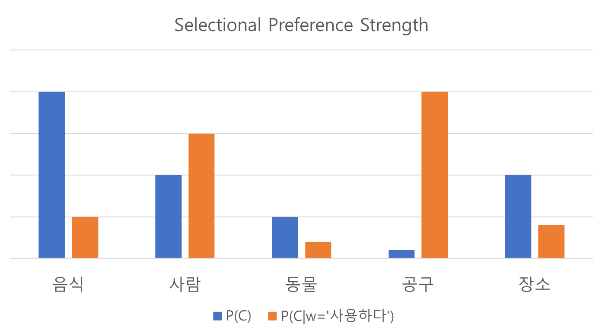

# Selectional Preference

이번 섹션에서는 selectional preference라는 개념에 대해서 다루어 보도록 하겠습니다. 문장은 여러 단어의 시퀀스로 이루어져 있습니다. 따라서 각 단어들은 문장내 주변의 단어들에 따라 그 의미가 정해지기 마련입니다. Selectional preference는 이를 좀 더 수치화하여 나타내 줍니다. 예를 들어 '마시다'라는 동사에 대한 목적어는 '<음료>' 클래스에 속하는 단어가 올 확률이 매우 높습니다. 따라서 우리는 '차'라는 단어가 '<탈 것>' 클래스에 속하는지 '<음료>' 클래스에 속하는지 쉽게 알 수 있습니다. 이런 성질을 이용하여 우리는 단어 중의성 해소(WSD)도 해결 할 수 있으며, 여러가지 문제들(syntactic disambiguation, semantic role labeling)을 수행할 수 있습니다.

## Selectional Preference Strength

앞서 언급한 것처럼 selectional preference는 단어와 단어 사이의 관계(예: verb-object)가 좀 더 특별한 경우에 대해 수치화 하여 나타냅니다. 술어(predicate) 동사(예: verb)가 주어졌을 때, 목적어(예: object)관계에 있는 headword 단어(보통은 명사가 될 겁니다.)들의 분포는, 평소 문서 내에 해당 명사(예: object로써 noun)가 나올 분포와 다를 것 입니다. 그 분포의 차이가 크면 클수록 해당 술어(predicate)는 더 강력한 selectional preference를 갖는다고 할 수 있습니다. 이것을 Philip Resnik은 [[Resnik et al.1997](http://www.aclweb.org/anthology/W97-0209)]에서 Selectional Preference Strength라고 명명하고 KL-divergence를 사용하여 정의하였습니다.

$$
\begin{aligned}
S_R(w)&=\text{KL}(P(C|w)||P(C)) \\
&=-\sum_{c\in\mathcal{C}}P(c|w)\log{\frac{P(c)}{P(c|w)}} \\
&=-\mathbb{E}_{C\sim P(C|w)}[\log{\frac{P(C)}{P(C|W=w)}}]
\end{aligned}
$$

위의 수식을 해석하면, selectional preference strength $S_R(w)$은 $w$가 주어졌을 때의 object class $C$의 분포 $P(C|w)$와 그냥 해당 class들의 prior(사전) 분포 $P(C)$와의 KL-divergence로 정의되어 있음을 알 수 있습니다. 즉, selectional preference strength는 술어(predicate)가 headword로 특정 클래스를 얼마나 선택적으로 선호(selectional preference)하는지에 대한 수치라고 할 수 있습니다.



예를 들어 '<음식>' 클래스의 단어는 '<공구>' 클래스의 단어보다 나타날 확률이 훨씬 높을 것 입니다. 이때, '사용하다'라는 동사(verb) 술어(predicate)가 주어진다면, 동사-목적어(verb-object) 관계에 있는 headword로써의 '<음식>' 클래스의 확률은 '<공구>' 클래스의 확률보다 낮아질 것 입니다.

## Selectional Association

이제 그럼 술어와 특정 클래스 사이의 선택 관련도를 어떻게 나타내는지 살펴보겠습니다. Selectional Association, $A_R(w,c)$은 아래와 같이 표현됩니다.

$$
A_R(w,c)=-\frac{P(c|w)\log{\frac{P(c)}{P(c|w)}}}{S_R(w)}
$$

위의 수식에 따르면, selectional preference strength가 낮은 술어(predicate)에 대해서 윗변의 값이 클 경우에는 술어와 클래스 사이에 더 큰 selectional association(선택 관련도)를 갖는다고 정의 합니다. 즉, selectional preference strength가 낮아서, 해당 술어(predicate)는 클래스(class)에 대한 선택적 선호 강도가 낮음에도 불구하고, 특정 클래스만 유독 술어에 영향을 받아서 윗변이 커질수록 selectional association의 수치도 커집니다.

예를 들어 어떤 아주 일반적인 동사에 대해서는 대부분의 클래스들이 prior(사전)확률 분포와 비슷하게 여전히 나타날 것입니다. 따라서 selectional preference strength, $S_R(w)$는 0에 가까울것 입니다. 하지만 그 가운데 해당 동사와 붙어서 좀 더 나타나는 클래스의 목적어가 있다면, selectional association $A_R(w,c)$는 매우 높게 나타날 것 입니다.

## Selectional Preference and WSD

눈치가 빠른 분들은 이미 눈치 채셨겠지만, 우리는 이런 selectional preference의 특성을 이용하여 단어 중의성 해소(Word Sense Disambiguation)에 활용할 수 있습니다. '마시다'라는 동사에 '차'라는 목적어가 함께 있을 때, 우리는 selectional preference를 통해서 '차'는 '<음료>' 클래스에 속한다고 말할 수 있을 것 입니다. 

문제는 '차'가 '<탈 것>' 또는 '<음료>' 클래스에 속하는 것을 알아내는 것 입니다. 우리가 가지고 있는 코퍼스는 단어들로 표현되어 있지, 클래스로 표현되어 있지는 않습니다. 만약 우리는 단어가 어떤 클래스들에 속하는지 미리 알고 있다면 단어들의 출현 빈도를 세어 클래스의 확률 분포를 estimation(추정)할 수 있을 것 입니다. 결국 이를 위해서는 사전에 정의되어 있는 지식 또는 데이터셋이 필요할 것 입니다.

## Selectional Preference based on WordNet

이때, WordNet이 위력을 발휘합니다. 우리는 WordNet을 통해서 '차(car)'의 hypernym을 알 수 있고, 이것을 클래스로 삼으면 우리가 필요한 정보들을 얻을 수 있습니다. 영어 WordNet에서의 예를 들어 'eat' 뒤에 있는 'bass'의 hypernym을 통해 먹는 물고기 'bass'인지, 악기 'bass'인지 구분 할 수 있을 것 입니다. [[Resnik et al.1997](http://www.aclweb.org/anthology/W97-0209)]에서는 술어와 클래스 사이의 확률 분포를 정의하기 위한 출현빈도를 계산하는 수식을 아래와 같이 제안하였습니다. 

$$
\text{Count}_R(w, c)\approx\sum_{h\in c}{\frac{\text{Count}_R(w,h)}{|\text{Classes}(h)|}}
$$

클래스 $c$에 속하는 headword, $h$는 실제 코퍼스(corpus)에 나타난 단어로써, 술어(predicate) $w$와 함꼐 출현한 headword $h$의 빈도를 세고, $h$가 속하는 클래스들의 set의 크기, $|\text{Classes}(h)|$로 나누어 줍니다. 그리고 이를 클래스 $c$에 속하는 모든 단어(headword)에 대해서 수행한 후, 이를 합한 값은 $Count_R(w,c)$를 근사(approximation)합니다.

$$
\hat{c}=\underset{c\in\mathcal{C}}{\text{argmax}}{A_R(w,c)},\text{ where }\mathcal{C}=\text{hypernym}(h).
$$

이를 통해 우리는 predicate $w$와 headword $h$가 주어졌을 때, $h$의 클래스 $c$를 추정한 $\hat{c}$를 구할 수 있습니다.

## Selectional Preference Evaluation using Pseudo Word

단어 중의성 해소(WSD)를 해결할 수 있는 방법 중에 하나로, selectional preference를 살펴 보았습니다. Selectional preference를 잘 해결할 수 있다면 아마도 단어 중의성 해소 문제도 잘 해결 될 것 입니다. 그럼 selectional preference를 어떻게 평가 할 수 있을까요? 정교한 테스트셋을 설계하고 만들어서 selectional preference의 성능을 평가 할 수 있겠지만, 좀 더 쉽고 general한 방법은 없을까요?

Pseudo Word가 하나의 해답이 될 수 있습니다. Pseudo word는 두개의 단어가 인위적으로 합성되어 만들어진 단어를 이릅니다. 실제 일상 생활에서 쓰이기보다는 단순히 두 단어를 합친 것 입니다. 예를 들어 banana와 door를 합쳐 banana-door라는 pseudo word를 만들어 낼 수 있습니다. 이 banana-door라는 단어는 사실 실생활에서 쓰일리 없는 단어입니다. 하지만 우리는 이 단어가 eat 또는 open이라는 동사 술어(verb predicate)와 함꼐 headword object로써 나타났을때, eat에 대해서는 banana를 선택해야 하고, open에 대해서는 door를 선택하도록 해야 올바른 selectional preference 알고리즘을 만들거나 구현했음을 확인할 수 있습니다.

[[Chambers et al.2010](https://web.stanford.edu/~jurafsky/chambers-acl2010-pseudowords.pdf)]

## Similarity-based Selectional Preference

위와 같이 selectional preference를 WordNet등의 도움을 받아 구현하는 방법을 살펴보았습니다. 하지만, WordNet이라는것은 아쉽게도 모든 언어에 존재하지 않으며, 새롭게 생겨난 신조어들도 반영되어 있지 않을 가능성이 매우 높습니다. 따라서 WordNet과 같은 thesaurus에 의존하지 않고 selectional preference를 구할 수 있으면 매우 좋을 것 입니다. [[Erk et al.2007](http://www.aclweb.org/anthology/P07-1028)]에서는 단어간의 유사도를 통해 thesaurus에 의존하지 않고 간단하게 selectional preference를 구하는 방법을 제시 하였습니다.

$$
(w,h,R),\text{ where }R\text{ is a relationship, such as verb-object}.
$$

이전과 같이 문제 정의는 비슷합니다. 술어(predicate) $w$와 headword $h$, 그리고 두 단어 사이의 관계 $R$이 tuple로 주어집니다. 이때, selectional association, $A_R(w,h_0)$은 아래와 같이 정의 할 수 있습니다.

$$
A_R(w,h_0)=\sum_{h\in\text{Seen}_R(w)}{\text{sim}(h_0,h)\cdot \phi_R(w,h)}
$$

이때, weight $\phi_R(w,h)$는 uniform하게 1로 주어도 되고, 아래와 같이 Inverse Document Frequency (IDF)를 사용하여 정의 할 수도 있습니다.

$$
\phi_R(w,h)=\text{IDF}(h)
$$

또한, $\text{sim}$함수는 이전에 다루었던 cosine similarity나 jaccard similarity를 포함하여 다양한 유사도 함수를 사용할 수 있습니다.

다만, 이전에 다루었던 selectional association은 $A_R(w,c)$을 다루었는데, 지금은 $A_R(w,h_0)$을 다루는 것이 차이점이긴 합니다. 하지만 우리는 좀 전에 selectional preference의 문제를 선호하는 클래스를 알아내는 것이 아닌, pseudo word와 같이 두 개의 단어가 주어졌을 때 선호하는 단어를 고르는 문제로 만들었습니다. 따라서 큰 문제가 되지 않습니다.

이 방법은 쉽게 WordNet과 같은 thesaurus 없이 쉽게 selectional preference를 계산할 수 있게 합니다. 하지만 유사도를 비교하기 위해서 $Seen_R(w)$ 함수를 통해 대상 단어를 선정하기 때문에, 코퍼스에 따라서 유사도를 구할 수 있는 대상이 달라지게 됩니다. 따라서 이에 따랏 커버리지 문제가 발생할 수 있습니다.

## Example

```python
from konlpy.tag import Mecab

def count_seen_headwords(lines, predicate='VV', headword='NNG'):
    mecab = Mecab()
    seen_dict = {}

    for line in lines:
        pos_result = mecab.pos(line)

        word_h = None
        word_p = None
        for word, pos in pos_result:
            if pos == predicate or pos[:3] == predicate + '+':
                word_p = word
                break
            if pos == headword:
                word_h = word

        if word_h is not None and word_p is not None:
            seen_dict[word_p] = [word_h] + ([] if seen_dict.get(word_p) is None else seen_dict[word_p])

    return seen_dict
```

```python
def get_selectional_association(predicate, headword, lines, dataframe, metric):
    v1 = torch.FloatTensor(dataframe.loc[headword].values)
    seens = count_seen_headwords(lines)[predicate]

    total = 0
    for seen in seens:
        try:
            v2 = torch.FloatTensor(dataframe.loc[seen].values)
            total += metric(v1, v2)
        except:
            pass

    return total
```

```python
query_p = '피웠'
query_h = ['담배', '맥주', '자동차']

selectional_associations = []
for h in query_h:
    selectional_associations += [get_selectional_association(query_p, h, lines, p, get_cosine_similarity)]

print(selectional_associations)
```

```
[tensor(3.9986), tensor(3.5938), tensor(3.7237)]
```