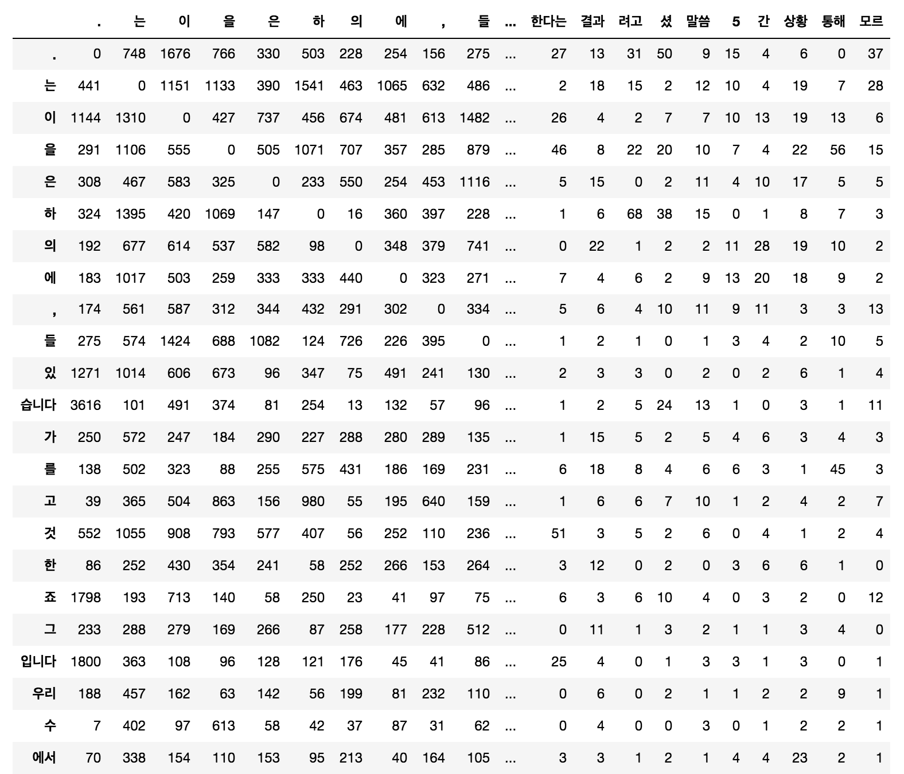
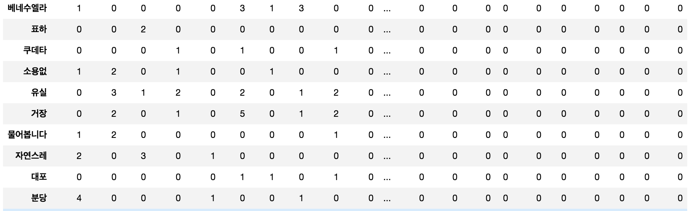

# Using Other Features for Similarity

이번엔 다른 방식으로 단어의 유사도를 구하는 방법에 접근 해보겠습니다. 자체적으로 단어에 대한 특성(feature)들을 모아 feature vector로 만들거나 유사도(similarity)를 계산하는 연산을 통해 단어간의 유사도를 구하는 방법입니다. 지금이야 어렵지않게 단어를 vector 형태로 embedding 할 수 있지만, 딥러닝 이전의 시대에는 쉽지 않은 일이었습니다. 이번 섹션을 통해서 딥러닝 이전의 전통적인 방식의 단어간의 유사도를 구하는 방법에 대해 알아보고, 이 방법의 단점과 한계에 대해서 살펴보겠습니다.

## Collecting Features

먼저, feature vector를 구성하는 방법들에 대해 살펴보고자 합니다. 결국 아래의 방법들이 하고자 하는 일은 같은 조건에 대해서 비슷한 수치를 반환하는 단어는 비슷한 유사도를 갖도록 벡터를 구성하는 것이라고 할 수 있습니다.

### Term-Frequency Matrix

앞서 우리는 TF-IDF에 대해서 살펴 보았습니다. TF-IDF에서 사용되었던 TF (term frequency)는 훌륭한 피쳐(feature)가 될 수 있습니다. 예를 들어 어떤 단어가 각 문서별로 출현한 횟수가 차원별로 구성되면, 하나의 feature vector를 이룰 수 있습니다. 물론 각 문서별 TF-IDF 자체를 사용하는 것도 좋습니다.

```python
def get_tf(docs):
    vocab = {}
    tfs = []
    for d in docs:
        vocab = get_term_frequency(d, vocab)
        tfs += [get_term_frequency(d)]

    from operator import itemgetter
    import numpy as np
    sorted_vocab = sorted(vocab.items(), key=itemgetter(1), reverse=True)

    stats = []
    for v, freq in sorted_vocab:
        tf_v = []
        for idx in range(len(docs)):
            if tfs[idx].get(v) is not None:
                tf_v += [tfs[idx][v]]
            else:
                tf_v += [0]

        print('%s\t%d\t%s' % (v, freq, '\t'.join(['%d' % tf for tf in tf_v])))
```

```python
>>> get_tf([doc1, doc2, doc3])
```

위의 코드를 사용하여 단어들의 각 문서별 출현횟수를 나타내면 아래와 같습니다.

|단어($w$)|TF($w$)|TF($w,d_1$)|TF($w,d_2$)|TF($w,d_3$)|
|-|-|-|-|-|
|는|47|15|14|18|
|을|39|8|10|21|
|이|32|8|8|16|
|은|15|6|2|7|
|가|14|1|7|6|
|여러분|12|5|6|1|
|말|11|5|1|5|
|남자|9|9|0|0|
|여자|7|5|0|2|
|차이|7|5|2|0|
|요인|6|0|6|0|
|겁니다|5|2|1|2|
|얼마나|5|4|1|0|
|심리학|5|5|0|0|
|학습|5|0|4|1|
|이야기|5|0|1|4|
|결과|5|0|4|1|
|실제로|4|2|1|1|
|능력|4|3|1|0|
|멀리|4|4|0|0|
|시험|4|0|4|0|
|환경|4|0|4|0|
|사람|3|1|0|2|
|동일|3|2|1|0|
|유형|3|0|3|0|
|인증|3|0|3|0|
|유전자|3|0|3|0|
|수행|3|0|2|1|
|연구|3|0|2|1|
|유전|3|0|3|0|
|쌍둥이|3|0|3|0|
|경우|3|0|3|0|
|모두|3|0|1|2|
|공유|3|0|3|0|
|인지|3|0|1|2|
|참여|3|0|0|3|
|몸짓|3|0|0|3|
|거짓말|3|0|0|3|

여기서 마지막 3개 column이 각 단어별 문서에 대한 출현횟수를 활용한 feature vector가 될 것 입니다. 지금은 문서가 3개밖에 없기 때문에, 사실 정확한 feature vector를 구성했다고 하기엔 무리가 있습니다. 따라서 문서가 많다면 우리는 지금보다 더 나은 feature vector를 구할 수 있을 것 입니다. 

하지만 문서가 너무나도 많을 경우에는 벡터의 차원이 너무 커져버릴 수 있습니다. 예를 들어 문서가 10,000개가 있다고 하면 단어 당 10,000차원의 벡터가 만들어질 것 입니다. 문제는 이 10,000차원의 벡터 대부분은 값이 없이 0으로 채워져 있을 것 입니다. 이렇게 벡터의 극히 일부분에만 의미있는 값들로 채워져 있는 벡터를 sparse vector라고 합니다. Sparse vector의 각 차원들은 사실 대부분의 경우 0일 것이기 때문에, 어떤 유의미한 통계를 얻는게 큰 장애물이 될 수 있습니다. 이처럼 희소성 문제는 자연어처리의 고질적인 문제로 작용 합니다.

또한, 단순히 문서에서의 출현 횟수를 가지고 feature vector를 구성하였기 때문에, 많은 정보가 유실되었고, 굉장히 단순화되어 여전히 매우 정확한 feature vector를 구성하였다고 하기엔 무리가 있습니다.

### Based on Context Window (Co-occurrence)

함께 나타나는 단어들을 활용한 방법 입니다. 의미가 비슷한 단어라면 쓰임새가 비슷할 것 입니다. 또한, 쓰임새가 비슷하기 때문에, 비슷한 문장 안에서 비슷한 역할로 사용될 것이고, 따라서 함께 나타나는 단어들이 유사할 것 입니다. 이러한 관점에서 우리는 함께 나타나는 단어들이 유사한 단어들의 유사도를 높게 주도록 만들어 줄 것 입니다.

함께 나타나는 단어들을 조사하기 위해서, 우리는 Context Window를 사용하여 windowing을 실행 합니다. (windowing이란 window를 움직이며 window안에 있는 유닛들의 정보를 취합하는 방법을 이릅니다.) 각 단어별로 window 내에 속해 있는 이웃 단어들을 counting하여 matrix로 나타내는 것 입니다.

이 방법은 좀 전에 다룬 문서 내의 단어 출현 횟수(term frequency)를 가지고 feature vector를 구성한 방식보다 좀 더 정확하다고 할 수 있습니다. 하지만, window의 크기라는 하나의 hyper-parameter가 추가되어, 사용자가 그 크기를 정해주어야 합니다. 만약 window의 크기가 너무 크다면, 현재 단어와 너무 관계가 없는 단어들까지 counting 될 수 있습니다. 하지만, 너무 작은 window 크기를 갖는다면, 관계가 있는 단어들이 counting되지 않을 수 있습니다. 따라서, 적절한 window 크기를 정하는 것이 중요 합니다. 또한, window를 문장을 벗어나서도 적용 시킬 것인지도 중요합니다. 문제에 따라 다르지만 대부분의 경우에는 window를 문장 내에만 적용합니다.

python 코드를 통해 아래와 같은 문장들에 대해서 우리는 windowing을 수행 할 수 있습니다.

|번호|내용|
|-|-|
|1|왜 냐고요 ?|
|2|산소 의 낭비 였 지요 .|
|3|어느 날 , 저 는 요요 를 샀 습니다 .|
|4|저 는 회사 의 가치 에 따른 가격 책정 을 돕 습니다 .|
|5|하지만 내게 매우 내부 적 인 문제 가 생겼 다 .|
|...|...|
|9995|고독 은 여러분 스스로 찾 을 수 있 는 곳 에 있 어서 다른 사람 들 에게 도 다가 갈 수 있 습니다 .|
|9996|두 번 째 로 이 발견 은 새로운 치료 방법 의 아주 분명 한 행로 를 제시 합니다 . 여기 서부터 무엇 을 해야 하 는지 는 로켓 과학자 가 아니 더라도 알 수 있 잖아요 .|
|9997|전쟁 전 에 는 시리아 도시 에서 그런 요구 들 이 완전히 무시 되 었 습니다 .|
|9998|세로 로 된 아찔 한 암석 벽 에 둘러쌓 여 있 으며 숲 에 숨겨진 은빛 폭포 도 있 죠 .|
|9999|얼마간 시간 이 지나 면 큰 소리 는 더 이상 큰 소리 가 아니 게 될 겁니다 .|
|10000|이러 한 마을 차원 의 아이디어 는 정말 훌륭 한 아이디어 입니다 .|

```python
def read(fn):
    lines = []

    f = open(fn, 'r')
    for line in f:
        if line.strip() != '':
            lines += [line.strip()]
    f.close()

    return lines
```

```python
def get_context_counts(lines, w_size=3):
    co_dict = {}
    for line in lines:
        words = line.split()

        for i, w in enumerate(words):
            for c in words[i - w_size:i + w_size]:
                if w != c:
                    co_dict[(w, c)] = 1 + (0 if co_dict.get((w, c)) is None else co_dict[(w, c)])

    return co_dict
```

```python
from operator import itemgetter

fn = 'test.txt'
min_cnt, max_cnt = 0, 100000

lines = read(fn)
co_dict = get_context_counts(lines)
tfs = get_term_frequency(' '.join(lines))
sorted_tfs = sorted(tfs.items(), key=itemgetter(1), reverse=True)

context_matrix = []
row_heads = []
col_heads = [w for w, f in sorted_tfs if f >= min_cnt and f<= max_cnt]
for w, f in sorted_tfs:
    row = []
    if f >= min_cnt and f <= max_cnt:
        row_heads += [w]
        for w_, f_ in sorted_tfs:
            if f_ >= min_cnt and f_ <= max_cnt:
                if co_dict.get((w, w_)) is not None:
                    row += [co_dict[(w, w_)]]
                else:
                    row += [0]
        context_matrix += [row]

import pandas as pd

p = pd.DataFrame(data=context_matrix, index=row_heads, columns=col_heads)
```

그리고 이 코드를 통해 얻은 결과의 일부는 아래와 같습니다. 이 결과에 따르면 1000개의 문장(문서)에서는 '습니다'의 context window 내에 마침표가 3616번 등장 합니다.



앞쪽 출현빈도가 많은 단어들은 대부분 값이 잘 채워져 있는 것을 볼 수 있습니다. 하지만 뒤쪽 출현빈도가 낮은 단어들은 많은 부분이 0으로 채워져 있는 것을 볼 수 있습니다. 출현빈도가 낮은 단어들의 row로 갈 경우에는 그 문제가 더욱 심각해 집니다.



위의 context windowing 실행 결과 얻은 feature vector들을 tSNE로 시각화 한 모습은 아래와 같습니다. 딱히 비슷한 단어끼리 모이지 않은 것도 많지만, 운좋게 비슷한 단어끼리 붙어 있는 경우도 종종 볼 수 있습니다.


## Get Similarity between Feature Vectors

그럼 이렇게 구해진 feature vector를 어떻게 사용할 수 있을까요? Feature vector는 단어 사이의 유사도를 구할 때 아주 유용하게 쓸 수 있습니다. 그럼 벡터 사이의 유사도 또는 거리는 어떻게 구할 수 있을까요? 아래에서는 두 벡터가 주어졌을 때, 벡터 사이의 유사도 또는 거리를 구하는 방법들에 대해 다루어 보겠습니다. 그리고 PyTorch를 사용하여 해당 수식들을 직접 구현 해 보겠습니다.

```python
import torch
```

### Manhattan Distance (L1 distance)

$$
\text{d}_{\text{L1}}(w,v)=\sum_{i=1}^d{|w_i-v_i|},\text{ where }w,v\in\mathbb{R}^d.
$$

L1 norm을 시용한 Manhattan distance (맨하튼 거리) 입니다. 이 방법은 두 벡터의 각 차원별 값의 차이의 절대값을 모두 합한 값 입니다.

```python
def get_l1_distance(x1, x2):
    return ((x1 - x2).abs()).sum()**.5
```

위의 코드는 torch tensor $x_1$, $x_2$를 입력으로 받아 L1 distance를 리턴해 주는 코드 입니다.

### Euclidean Distance (L2 distance)

$$
\text{d}_{\text{L2}}(w,v)=\sqrt{\sum_{i=1}^d{(w_i-v_i)^2}},\text{ where }w,v\in\mathbb{R}^d.
$$

우리가 가장 친숙한 거리 방법 중의 하나인 Euclidean distance (유클리드 거리)입니다. 각 차원별 값 차이의 제곱의 합에 루트를 취한 형태 입니다.

```python
def get_l2_distance(x1, x2):
    return ((x1 - x2)**2).sum()**.5
```

L2 distance를 구하기 위해 torch tensor들읍 입력으로 받아 계산하는 함수의 코드는 위와 같습니다.


위의 그림은 Manhanttan distance와 Euclidean distance의 차이를 쉽게 나타낸 그림 입니다. Euclidean distance를 의미하는 초록색 선을 제외하고 나머지 Manhattan distance를 나타내는 세가지 선의 길이는 모두 같습니다. Manhattan distance는 그 이름답게 마치 잘 계획된 도시의 길을 지나가는 듯한 선의 형태를 나타내고 있습니다.

### Using Infinity Norm

$$
d_{\infty}(w,v)=\max(|w_1-v_1|,|w_2-v_2|,\cdots,|w_d-v_d|),\text{ where }w,v\in\mathbb{R}^d
$$

$L_1$, $L_2$ distance가 있다면 $L_\infty$ distance도 있습니다. 재미있게도 infinity norm을 이용한 distance는 각 차원별 값의 차이 중 가장 큰 값을 나타냅니다. 위의 수식을 torch tensor에 대해서 계산하는 코드는 아래와 같습니다.

```python
def get_infinity_distance(x1, x2):
    return ((x1 - x2).abs()).max()
```


위의 그림은 각 $L_1$, $L_2$, $L_\infty$ 별로 거리의 크기가 $r$일때 모습 입니다.

### Cosine Similarity

$$
\begin{aligned}
\text{sim}_{\text{cos}}(w,v)&=\overbrace{\frac{w\cdot v}{|w||v|}}^{\text{dot product}}
=\overbrace{\frac{w}{|w|}}^{\text{unit vector}}\cdot\frac{v}{|v|} \\
&=\frac{\sum_{i=1}^{d}{w_iv_i}}{\sqrt{\sum_{i=1}^d{w_i^2}}\sqrt{\sum_{i=1}^d{v_i^2}}} \\
\text{where }&w,v\in\mathbb{R}^d
\end{aligned}
$$

위와 같은 수식을 갖는 cosine similarity(코사인 유사도)함수는 두 벡터 사이의 방향과 크기를 모두 고려하는 방법 입니다. 수식에서 분수의 윗변은 두 벡터 사이의 element-wise 곱을 사용하므로 벡터의 내적과 같습니다. 따라서 cosine similarity의 결과가 $1$에 가까울수록 방향은 일치하고, $0$에 가까울수록 수직(orthogonal)이며, $-1$에 가까울수록 반대 방향임을 의미 합니다. 위와 같이 cosine similarity는 크기와 방향 모두를 고려하기 때문에, 자연어처리에서 가장 널리 쓰이는 유사도 측정 방법 입니다. 하지만 수식 내 윗변의 벡터 내적 연산이나 밑변 각 벡터의 크기(L2 norm)를 구하는 연산이 비싼 편에 속합니다. 따라서 vector 차원의 크기가 클수록 연산량이 부담이 됩니다.

Cosine similarity는 아래와 같이 PyTorch 코드로 나타낼 수 있습니다.

```python
def get_cosine_similarity(x1, x2):
    return (x1 * x2).sum() / ((x1**2).sum()**.5 * (x2**2).sum()**.5)
```

### Jaccard Similarity

$$
\begin{aligned}
\text{sim}_{\text{jaccard}}(w,v)&=\frac{|w \cap v|}{|w \cup v|} \\
&=\frac{|w \cap v|}{|w|+|v|-|w \cap v|} \\
&\approx\frac{\sum_{i=1}^d{\min(w_i,v_i)}}{\sum_{i=1}^d{\max(w_i,v_i)}} \\
\text{where }&w,v\in\mathbb{R}^d.
\end{aligned}
$$

Jaccard similarity는 두 집합 간의 유사도를 구하는 방법 입니다. 수식의 윗변에는 두 집합의 교집합의 크기가 있고, 이를 밑변에서 두 집합의 합집합의 크기로 나누어 줍니다. 이때, Feature vector의 각 차원이 집합의 element가 될 것 입니다. 다만, 각 차원에서의 값이 $0$ 또는 $0$이 아닌 값이 아니라, 수치 자체에 대해서 Jaccard similarity를 구하고자 할 때에는, 두번째 줄의 수식과 같이 두 벡터의 각 차원의 숫자에 대해서 $\min$, $\max$ 연산을 통해서 계산 할 수 있습니다. 이를 PyTorch 코드로 나타내면 아래와 같습니다.

```python
def get_jaccard_similarity(x1, x2):
    return torch.stack([x1, x2]).min(dim=0)[0].sum() / torch.stack([x1, x2]).max(dim=1)[0].sum()
```

## Appendix: Similarity between Documents

방금은 단어에 대한 feature를 수집하고 유사도를 구하였다면, 마찬가지로 문서에 대해 feature를 추출하여 문서간의 유사도를 구할 수 있습니다. 예를 들어 문서내의 단어들에 대해 출현 빈도(term frequency)나 TF-IDF를 구하여 vector를 구성하고, 이를 활용하여 vector 사이의 유사도를 구할 수도 있을 것 입니다.